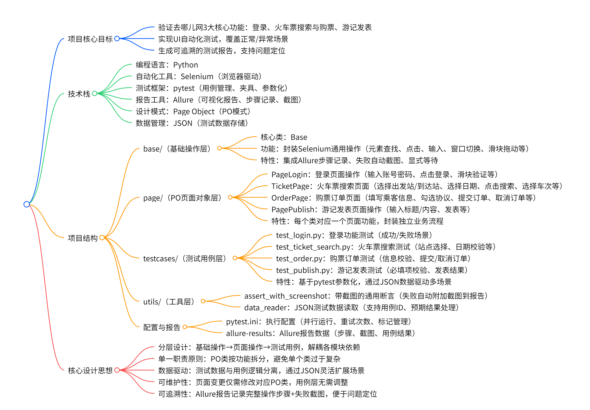

# 去哪儿网核心功能UI自动化测试项目

## 项目简介

本项目针对去哪儿网的核心业务流程（登录、购票、游记发表）进行了端到端的UI自动化测试，旨在保障主要功能的稳定性和用户体验。项目采用主流自动化测试技术栈，具备良好的可维护性、可扩展性和工程化实践。

---

## 技术栈

| 分类             | 技术/工具            | 说明                                             |
| ---------------- | -------------------- | ------------------------------------------------ |
| 编程语言与环境   | Python 3.10          | 主流自动化测试开发语言                           |
| 自动化测试框架   | Selenium             | Web UI自动化测试核心库，支持多浏览器驱动         |
|                  | Pytest               | 测试用例组织与执行，支持参数化、夹具、并发等功能 |
|                  | Allure               | 测试报告生成，支持详细步骤、截图、参数展示       |
| 工程化与设计模式 | Page Object (PO)     | 页面对象，组装并封装自定义方法                   |
|                  | 数据驱动（JSON）     | 测试数据与用例分离，便于批量测试和用例扩展       |
|                  | 夹具（Fixtures）     | 统一管理浏览器驱动和页面对象的初始化与销毁       |
| 辅助工具与配置   | assertpy             | 断言库，提升断言表达力                           |
|                  | pytest-xdist         | 并发执行测试用例，加快回归速度                   |
|                  | pytest-rerunfailures | 失败用例自动重跑，提升稳定性                     |

---

## 项目结构




## 主要功能覆盖

- **登录功能**：支持正常登录、异常登录（账号/密码错误、未勾选协议、未填写信息等）场景。
- **购票功能**：支持正常购票、信息不全、未勾选协议等多种场景，并支持订单取消等操作。
- **游记发表**：支持正常发表、信息不全等场景，支持新建和修改游记流程。

---

## 工程化亮点

- **高度封装**：基础操作、页面对象、工具方法分层封装，提升代码复用性和可维护性。
- **数据驱动**：所有测试用例均采用JSON参数化，便于批量测试和用例扩展。
- **自动截图与报告**：断言失败自动截图，集成Allure报告，便于问题定位和回溯。
- **复杂交互支持**：对多窗口、滑块验证等复杂UI交互进行了良好封装。
- **异常处理**：关键步骤均有异常捕获与截图，提升调试效率。
- **并发与重跑**：pytest-xdist并发执行，pytest-rerunfailures自动重跑，提升测试效率和稳定性。
- **夹具管理**：统一管理浏览器驱动和页面对象，保证测试环境的独立性和可控性。

---

## 快速开始

1. 安装依赖  

   ```bash
   pip install -r requirements.txt
   ```

2. 运行测试，自动生成Allure报告 

   ```bash
   python main.py
   ```

3. 查看allure测试报告


---

## 夹具与启动配置说明

- **夹具（fixtures）**：统一管理浏览器驱动和页面对象的初始化与销毁，保证每个用例环境独立。
  - `get_driver`：初始化并关闭浏览器。
  - `get_login_page`、`get_purchase_page`、`get_publish_page`：分别初始化对应的PO对象。
- **pytest.ini**：统一配置pytest参数，包括Allure报告目录、并发执行、失败重跑、用例分组等。

```ini
[pytest]
addopts = -vs --alluredir=allure-results --clean-alluredir --reruns 1 -n 3
markers =
    login: 登录功能测试
    purchase: 购票功能测试
    publish: 游记功能测试
```

---

## 个人收获与项目价值

- 掌握了UI自动化测试的主流技术栈和工程化实践。
- 提升了代码结构设计、异常处理和自动化测试覆盖率的能力。